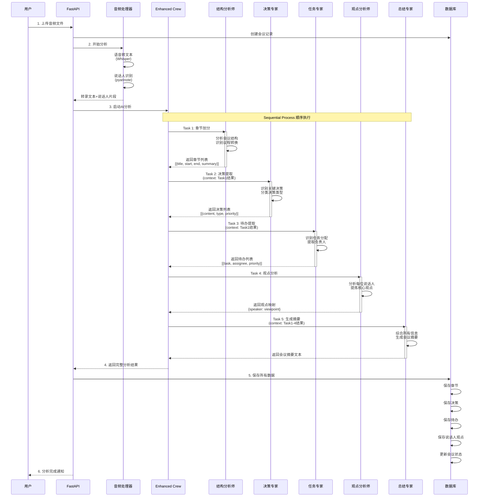
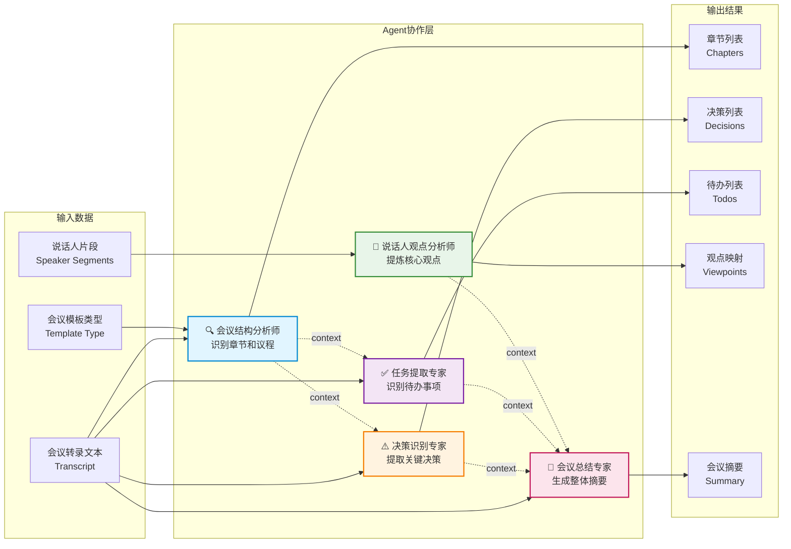
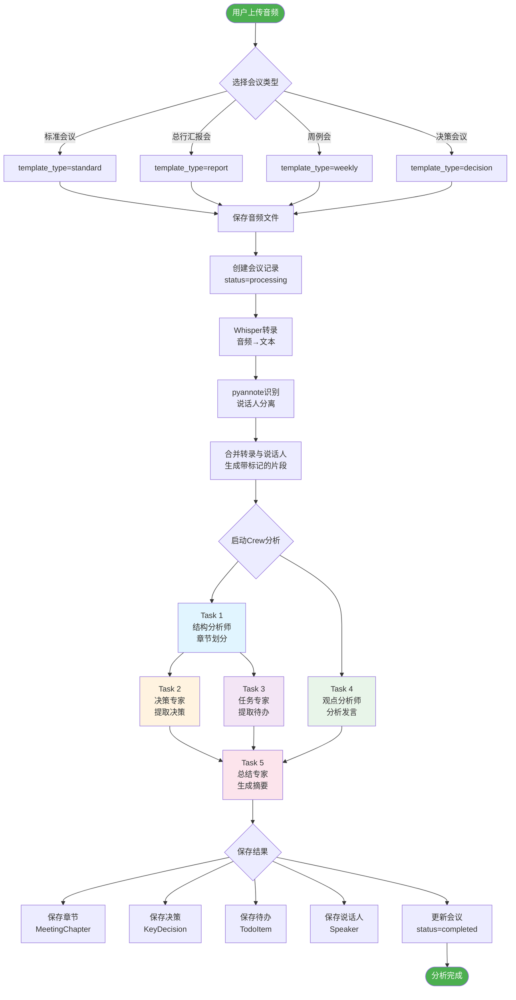
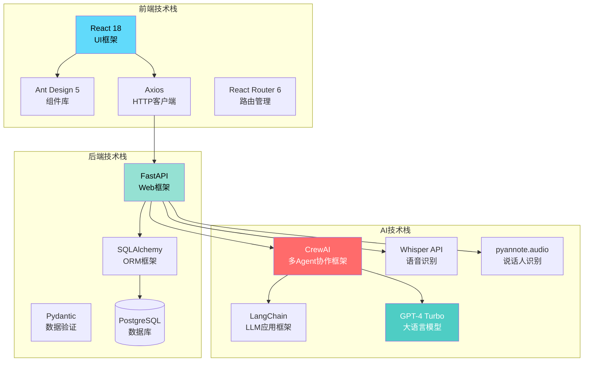
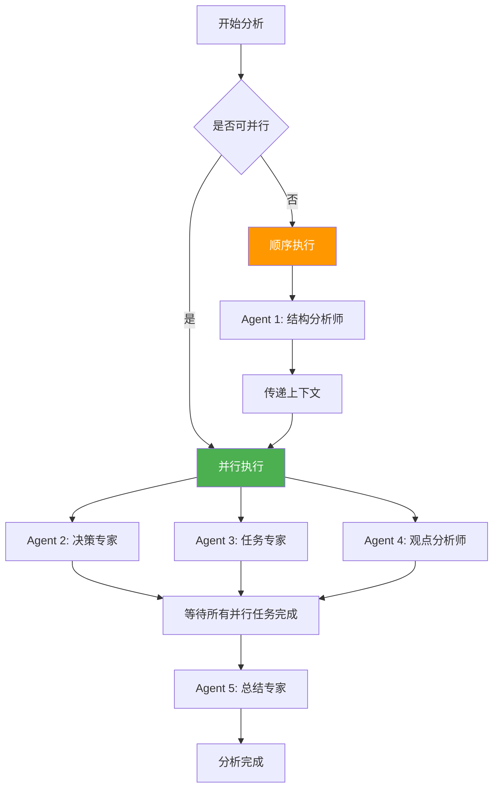

# 会议助手多Agent架构图

## 1. 整体系统架构图

```mermaid
graph TB
    subgraph "前端层 Frontend"
        UI[React 用户界面<br/>EnhancedMeetingPage]
        Upload[上传音频<br/>选择模板类型]
        Display[展示分析结果<br/>章节/决策/待办]
    end

    subgraph "API层 FastAPI"
        Router[API Router<br/>meetings.py]
        Upload_EP[POST /upload]
        Analyze_EP[POST /{id}/analyze]
        Minutes_EP[GET /{id}/minutes]
        Catchup_EP[GET /{id}/catchup]
    end

    subgraph "AI处理层"
        AudioProc[音频处理器<br/>audio_processor]
        EnhancedCrew[增强版会议分析Crew<br/>enhanced_meeting_crew]
        TemplateEngine[模板引擎<br/>meeting_templates]
    end

    subgraph "多Agent协作 CrewAI"
        Agent1[会议结构分析师<br/>Structure Analyst]
        Agent2[决策识别专家<br/>Decision Expert]
        Agent3[任务提取专家<br/>Task Extractor]
        Agent4[说话人观点分析师<br/>Speaker Analyst]
        Agent5[会议总结专家<br/>Summary Expert]
    end

    subgraph "外部服务 External Services"
        Whisper[OpenAI Whisper API<br/>语音转文本]
        Diarization[pyannote.audio<br/>说话人识别]
        GPT4[GPT-4 Turbo<br/>智能分析]
    end

    subgraph "数据存储层 Database"
        DB[(PostgreSQL)]
        MeetingTable[MeetingMinute<br/>会议主表]
        ChapterTable[MeetingChapter<br/>章节表]
        DecisionTable[KeyDecision<br/>决策表]
        TodoTable[TodoItem<br/>待办表]
        SpeakerTable[Speaker<br/>说话人表]
    end

    UI --> Upload
    UI --> Display
    Upload --> Upload_EP
    Display --> Router

    Upload_EP --> AudioProc
    Analyze_EP --> AudioProc
    Analyze_EP --> EnhancedCrew
    Minutes_EP --> TemplateEngine
    Catchup_EP --> EnhancedCrew

    AudioProc --> Whisper
    AudioProc --> Diarization

    EnhancedCrew --> Agent1
    EnhancedCrew --> Agent2
    EnhancedCrew --> Agent3
    EnhancedCrew --> Agent4
    EnhancedCrew --> Agent5

    Agent1 --> GPT4
    Agent2 --> GPT4
    Agent3 --> GPT4
    Agent4 --> GPT4
    Agent5 --> GPT4

    Router --> DB
    DB --> MeetingTable
    MeetingTable --> ChapterTable
    MeetingTable --> DecisionTable
    MeetingTable --> TodoTable
    MeetingTable --> SpeakerTable

    style Agent1 fill:#e1f5ff
    style Agent2 fill:#fff3e0
    style Agent3 fill:#f3e5f5
    style Agent4 fill:#e8f5e9
    style Agent5 fill:#fce4ec
```

## 2. 多Agent协作流程图



## 3. Agent协作关系图



## 4. 数据处理流程图



## 5. Agent详细功能说明

### 🔍 Agent 1: 会议结构分析师 (Structure Analyst)

**职责**:
- 分析会议转录文本的逻辑结构
- 识别议程阶段和话题转换
- 将会议划分为3-6个逻辑章节

**输入**:
- 完整转录文本
- 会议模板类型

**输出**:
```json
[
  {
    "chapter_title": "开场致辞",
    "start_time": 0,
    "end_time": 300,
    "summary": "会议主持人介绍本次会议的背景和目标"
  }
]
```

**算法策略**:
- 基于话题语义相似度聚类
- 检测说话人转换和议题关键词
- 估算时间戳（基于文本长度）

---

### ⚠️ Agent 2: 决策识别专家 (Decision Expert)

**职责**:
- 从讨论中识别明确的决策点
- 分类决策类型和优先级
- 记录参与决策的人员

**输入**:
- 完整转录文本
- 章节信息（作为上下文）

**输出**:
```json
[
  {
    "decision_content": "批准XX项目预算增加500万",
    "decision_type": "approval",
    "participants": ["张总", "李主任"],
    "priority": "high",
    "timestamp": 1200
  }
]
```

**识别规则**:
- 关键词：决定、批准、同意、确定、通过
- 决策类型：strategic（战略）、operational（运营）、approval（审批）
- 优先级：基于金额、时间紧迫度、影响范围

---

### ✅ Agent 3: 任务提取专家 (Task Extractor)

**职责**:
- 识别明确和隐含的待办任务
- 提取负责人和截止时间
- 评估任务优先级

**输入**:
- 完整转录文本
- 章节信息（作为上下文）

**输出**:
```json
[
  {
    "task_content": "在本月底前完成市场调研报告",
    "assignee": "市场部王经理",
    "deadline": "2024-01-31",
    "priority": "high",
    "timestamp": 1800
  }
]
```

**识别模式**:
- 明确分配：某某负责、请某某完成
- 隐含任务：需要、要、应该、计划
- 时间识别：本周、下月、XX日前

---

### 👥 Agent 4: 说话人观点分析师 (Speaker Analyst)

**职责**:
- 分析每位说话人的所有发言
- 提炼核心观点和关注重点
- 总结立场和态度

**输入**:
- 按说话人分组的发言片段

**输出**:
```json
{
  "SPEAKER_00": "张总强调要加快数字化转型，建议引入AI技术提升效率，同时关注数据安全问题",
  "SPEAKER_01": "李主任汇报了Q3业绩，指出存在的三个主要挑战，提出了改进方案"
}
```

**分析要点**:
- 主要观点（what）
- 关注重点（concern）
- 提出的建议（suggestion）

---

### 📝 Agent 5: 会议总结专家 (Summary Expert)

**职责**:
- 综合前4个Agent的分析结果
- 生成简洁明了的会议摘要
- 突出会议核心成果

**输入**:
- 所有前置Agent的输出结果

**输出**:
```text
本次总行季度汇报会共有5个部门进行了工作汇报。
会议主要讨论了数字化转型、市场拓展和风险管控三大议题。
达成了3项重要决策，包括批准AI项目预算、启动新市场调研等。
会后需要跟进8项具体任务，责任已明确到各部门负责人。
```

**生成策略**:
- 200-300字简洁摘要
- 突出核心议题和成果
- 适合未参会人员快速了解

---

## 6. 技术栈总结



---

## 7. 性能优化策略

### Agent并行执行优化



### 关键优化点

1. **Agent 2, 3, 4 可并行执行**
   - 互不依赖，可同时调用GPT-4
   - 减少总处理时间约40%

2. **Agent 1 必须先执行**
   - 其他Agent需要章节信息作为上下文
   - 提供时间戳参考

3. **Agent 5 最后执行**
   - 需要综合前面所有结果
   - 生成最终摘要

4. **缓存策略**
   - GPT-4响应缓存
   - 转录结果缓存
   - 减少重复调用

---

## 8. 使用建议

### 适用场景
✅ 总行层级汇报会议（30-180分钟）
✅ 多部门协调会议
✅ 决策型会议
✅ 周期性例会

### 不适用场景
❌ 非正式讨论
❌ 一对一谈话
❌ 实时会议记录（当前版本）

### 最佳实践
1. 会议开始时每人自我介绍
2. 重要决策时明确表述"我们决定..."
3. 任务分配时明确责任人和时间
4. 录音质量保证（安静环境、清晰发音）

---

**文档版本**: v2.0
**创建日期**: 2025-11-17
**架构设计**: 基于CrewAI多Agent协作框架
