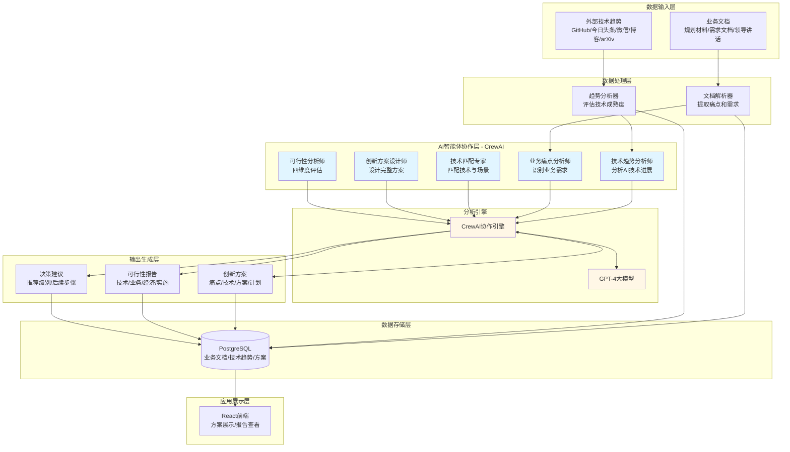
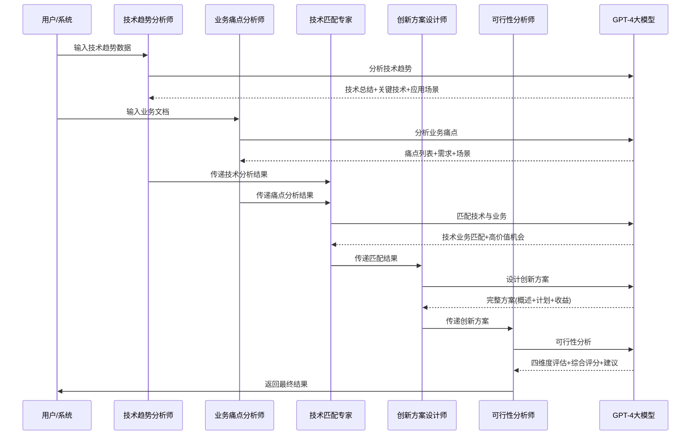
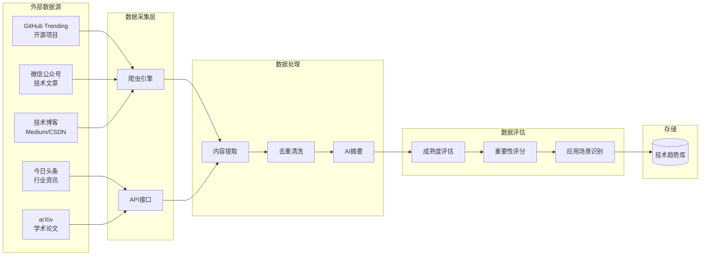
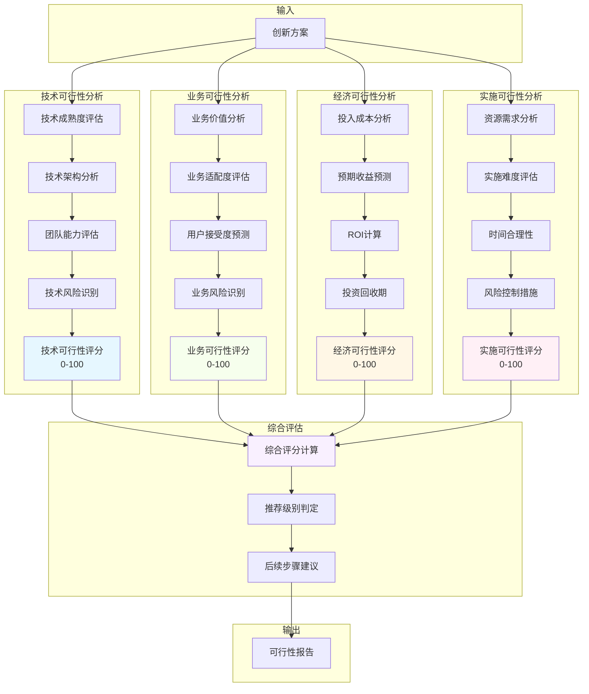
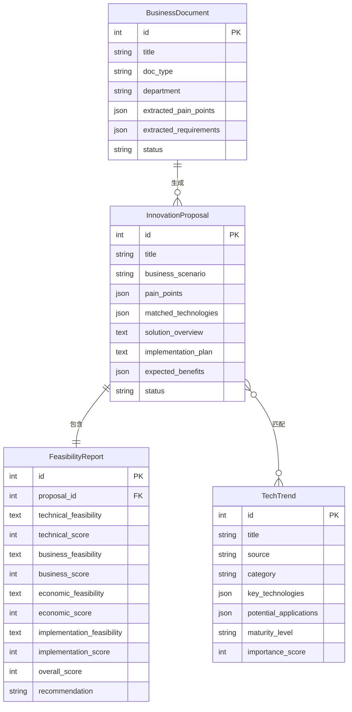
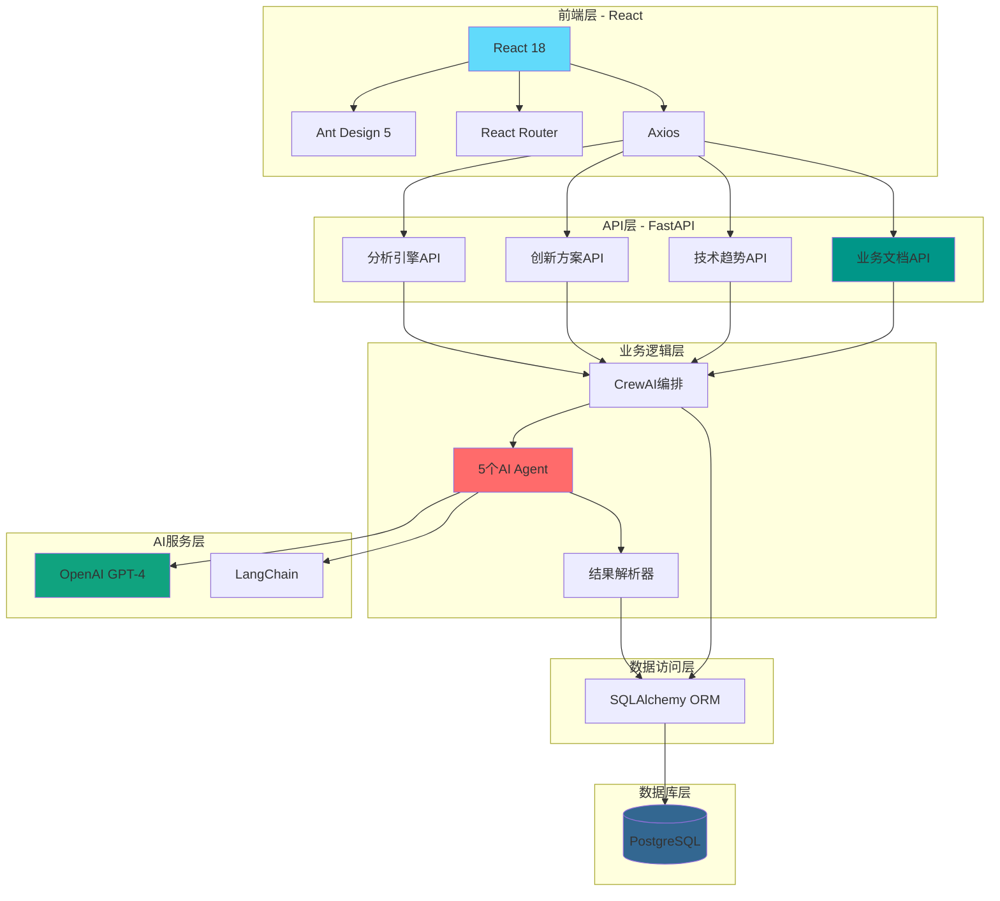
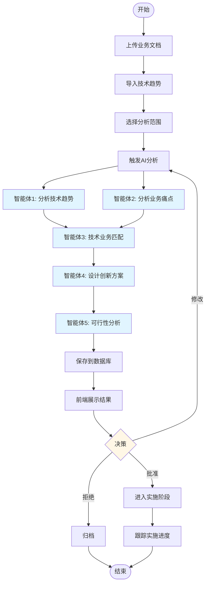
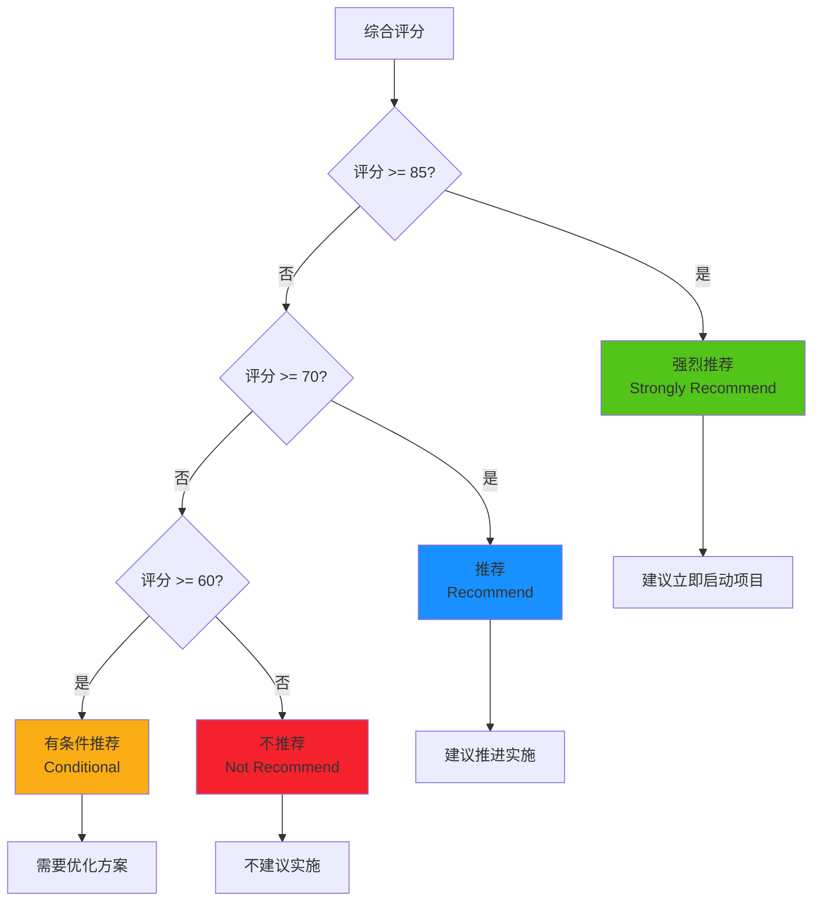

# 业务创新挖掘平台架构图

## 系统整体架构

## 5个AI智能体协作流程

## 技术趋势数据采集架构

## 可行性分析四维度架构

## 数据模型关系图

## 前后端技术栈架构

## 系统工作流程

## 推荐级别判定逻辑

---

**架构说明**：

1. **数据输入层**：收集行内业务文档和行外技术趋势
2. **AI智能体层**：5个专业智能体分工协作分析
3. **分析引擎**：基于CrewAI和GPT-4的智能分析
4. **输出生成层**：生成创新方案和可行性报告
5. **应用展示层**：React前端可视化展示

**架构版本**：v1.0
**更新日期**：2025-11-17
